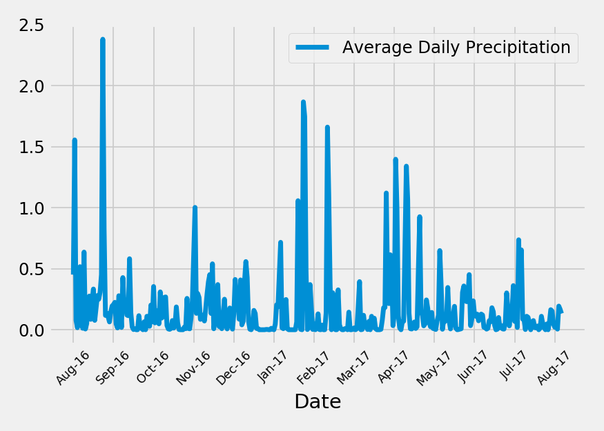
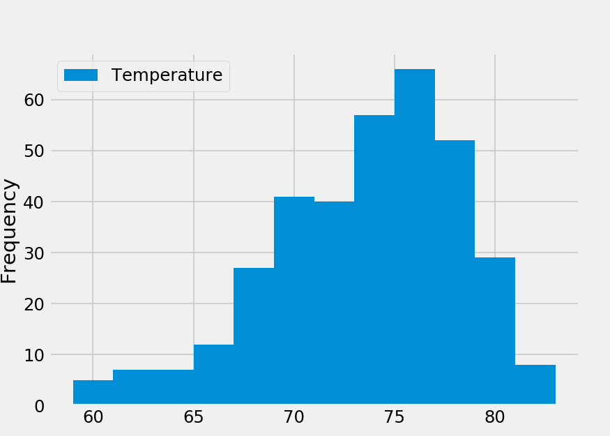
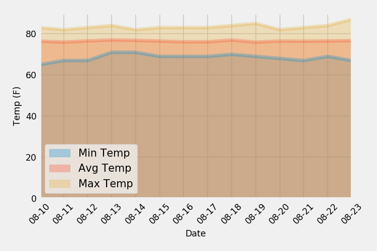

# Climate_App

**Tasks**: 
1. Explore the climate database for Honolulu, Hawaii, run climate analyze and visulaze the results;
2. Create a Flask API that returns weather data from the database up on user queries.

**Data**: [hawaii.sqlite](Resources/hawaii.sqlite)

**Lanugage**: Python

**Libraries**: sqlalchemy, flask, matplotlib, pandas  

**Deployed on** Heroku

**Notebook**: [Jupyter Notebook](Climate_Analysis.ipynb)

### Flask API is like here:
### Climate analysis results:
* Precipitation Analysis

* Temperature Analysis

* Daily normals (averages for min, avg, and max temperatures)

#
#### Copyright
Data Boot Camp ©2018. All Rights Reserved.
